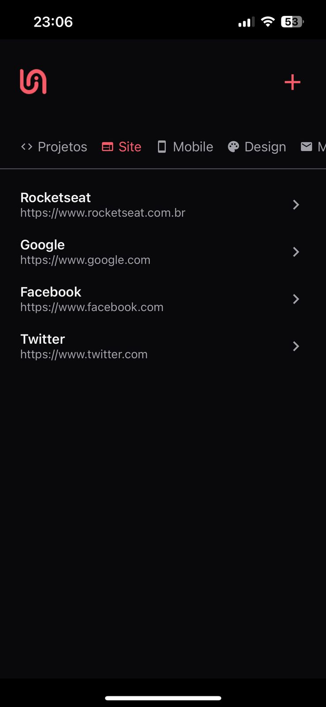
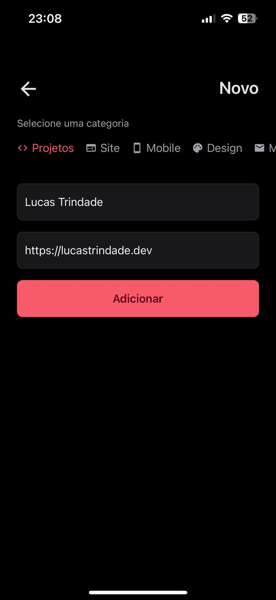

# Link Saver RN

## 📱 Sobre o Projeto

Link Saver é meu primeiro aplicativo mobile desenvolvido para entender os fundamentos do React Native. O app permite salvar e organizar links em diferentes categorias, oferecendo uma interface intuitiva e moderna.

## 🚀 Tecnologias Utilizadas

- [React Native](https://reactnative.dev/) - Framework para desenvolvimento mobile
- [Expo](https://expo.dev/) - Plataforma para desenvolvimento React Native
- [TypeScript](https://www.typescriptlang.org/) - Superset JavaScript com tipagem estática
- [Expo Router](https://docs.expo.dev/router/introduction/) - Sistema de navegação

## 🎨 Features

- Interface moderna e intuitiva
- Categorização de links
- Validação de URLs
- Design responsivo
- Tema escuro

## 🚀 Como Executar

1. Clone o repositório
2. Instale as dependências com `npm install` ou `yarn install`
3. Inicie o projeto com `npx expo start`
4. Escaneie o QRCode com o app Expo Go

## 📸 Screenshots

  
  

## 📝 Aprendizados

Este projeto foi fundamental para meu aprendizado em:
- Estruturação de projetos React Native
- Gerenciamento de estado
- Navegação entre telas
- Componentização
- Estilização no React Native
- Uso de tipagem com TypeScript

## 🤝 Contribuições

Contribuições são sempre bem-vindas! Sinta-se à vontade para abrir uma issue ou fazer um pull request.

## 📚 Curso Utilizado para o Desenvolvimento

[Rocketseat - React Native](https://app.rocketseat.com.br/classroom/curso-de-entrada-react-native) - Um curso abrangente que cobre os fundamentos do React Native, incluindo práticas recomendadas e desenvolvimento de aplicativos reais.

## 📄 Licença

Este projeto está sob a licença MIT, permitindo que você use, modifique e distribua o código. Para mais detalhes, veja o arquivo [LICENSE](LICENSE).